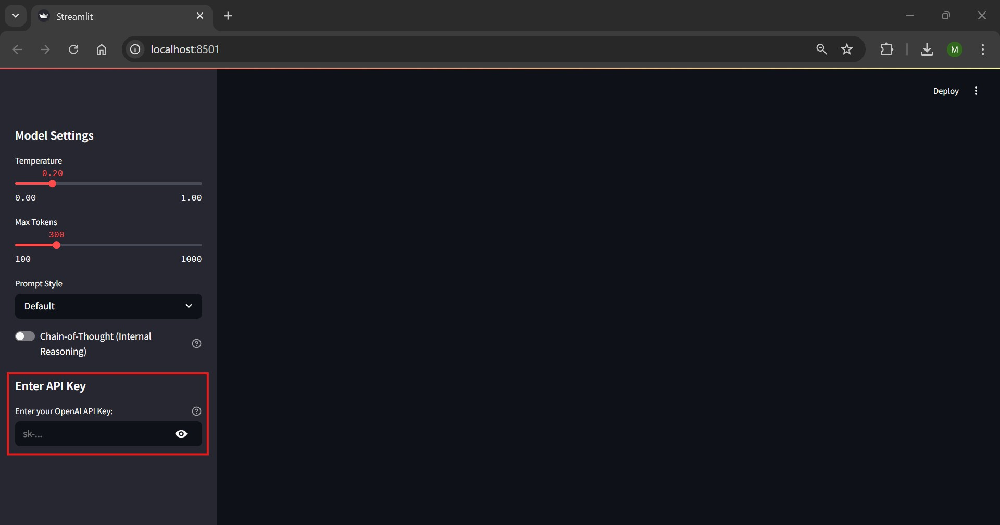
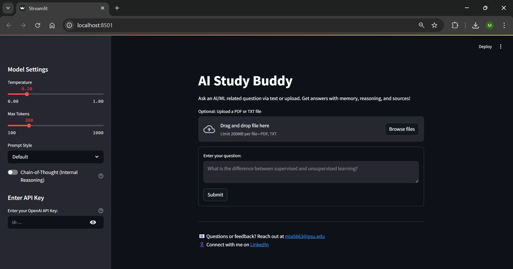
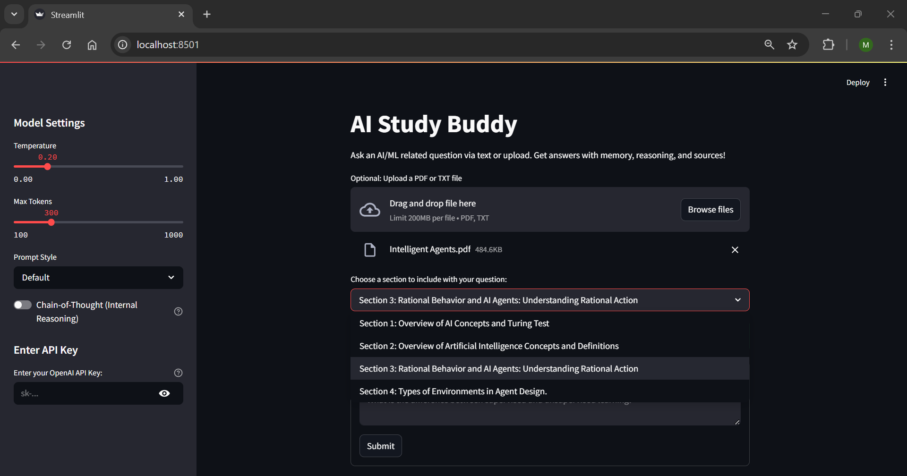
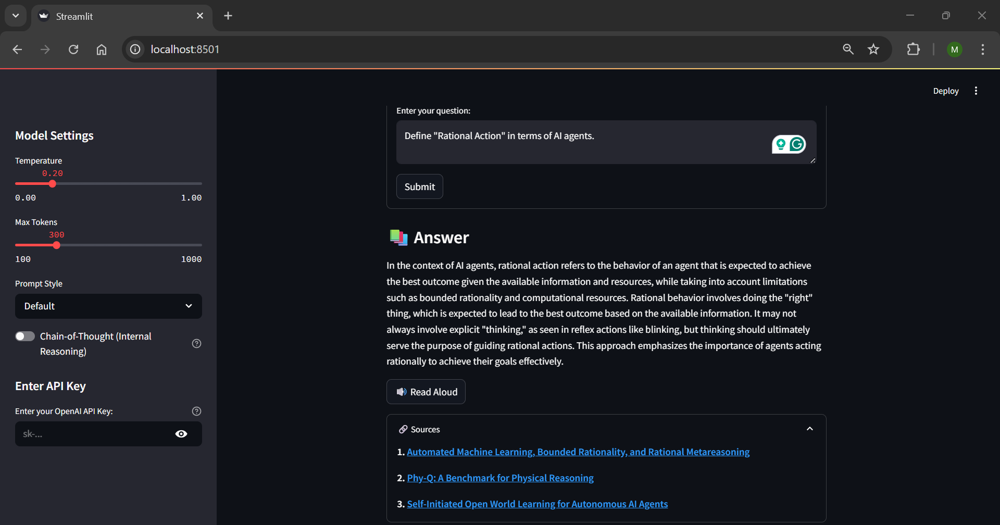
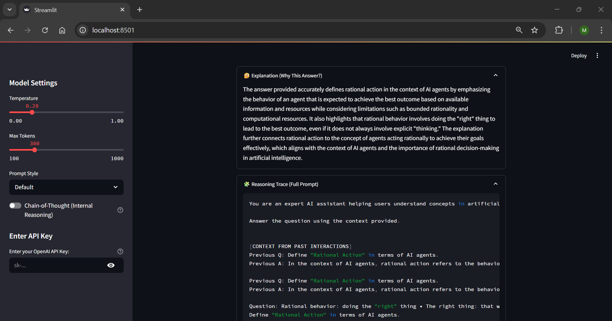
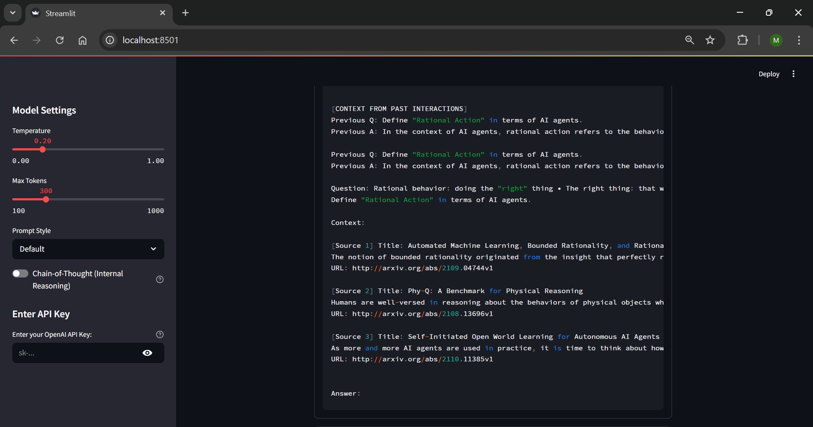
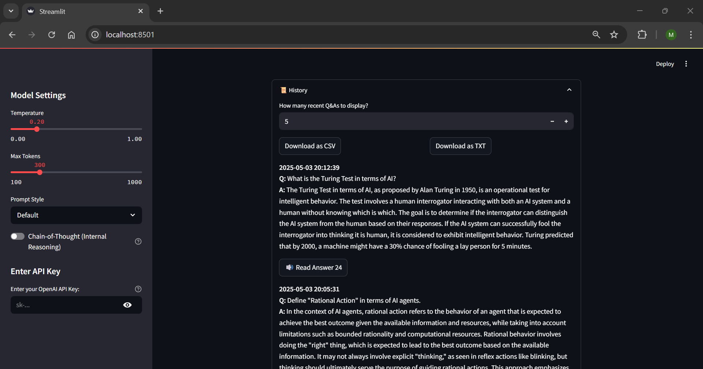

# AI Study Buddy

**AI Study Buddy** is a retrieval-augmented, voice-enabled assistant for answering questions about AI and ML topics using real academic sources and contextual memory.

Whether you’re diving into neural networks or asking about transformers, this assistant retrieves relevant paper chunks, builds thoughtful prompts, and speaks the answer, all from a clean web UI powered by Streamlit and OpenAI.

---

## Features at a Glance

- **Retrieval-Augmented Generation (RAG)**  
  Finds the most relevant paper chunks from an Arxiv-based dataset using FAISS vector search.

- **Document Uploads (PDF/TXT)**  
  Upload and search over your own files, broken down into manageable, titled chunks.

- **Session Memory**  
  Keeps track of your previous questions/answers during a session to improve continuity.

- **Prompt Styles**  
  Choose from Default, Concise, Beginner-Friendly, Explain Step-by-Step, or With Citations Only. You can also enable Chain-of-Thought mode for more deliberate, internally reasoned answers.

- **Reasoning & Explanation Panels**  
  Displays the full prompt that was used, and a follow-up explanation of why the answer makes sense.

- **Text-to-Speech (TTS)**  
  Click-to-read answers or history entries aloud using pyttsx3 for local speech synthesis.

- **Downloadable Q&A History**  
  Export your full session as `.csv` or `.txt`.

- **Secure API Key Entry**  
  Users must enter a valid OpenAI API key before accessing the app features.

- **Automated Testing & Coverage**  
  Pytest suite with coverage reporting for core modules and logic.

---

## Test Coverage


> Coverage is calculated using `pytest --cov=src` and includes logic for retrieval, chunking, memory, TTS, and prompt generation.

---

## App Walkthrough

Below is a step-by-step visual walkthrough of the application. Each image corresponds to a key phase in the user journey.

**API Key Entry**  
A secure field prompts the user to enter an OpenAI API key before usage.  


**Home Screen**  
Default interface showing model controls, the input form, and an empty state.  


**Uploading a PDF/TXT**  
Drag-and-drop interface for uploading a document. A dropdown lets you select a titled chunk.  


**Question Answered with Sources**  
App displays the generated answer followed by source links used.  


**Reasoning & Prompt Trace**  
Expandable panels show both the explanation and full prompt that led to the answer.  
  


**Session History & Downloads**  
See your recent session Q&A and export to CSV or TXT formats.  


---

## Tech Stack

- Python 3.10+
- [Streamlit](https://streamlit.io/)
- [OpenAI API](https://openai.com/)
- [FAISS](https://github.com/facebookresearch/faiss)
- [PyMuPDF](https://pymupdf.readthedocs.io/) for PDFs
- [pyttsx3](https://pyttsx3.readthedocs.io/) for TTS
- [pytest](https://docs.pytest.org/) with `pytest-cov` for testing

---

## Getting Started

1. **Clone the repository**
    ```bash
    git clone https://github.com/mohammed0823/ai-study-buddy.git
    cd ai-study-buddy
    ```

2. **Set up the environment**
    ```bash
    python -m venv venv
    source venv/bin/activate  # On Windows: venv\Scripts\activate
    pip install -r requirements.txt
    ```

3. **Launch the app**
    ```bash
    streamlit run app.py
    ```

4. **Enter your OpenAI API key**  
   You will be prompted in the sidebar before using any features.

5. **Ask a question or upload a document**
   - Type a question like *"What is a transformer in deep learning?"*
   - Or upload a paper and choose which section to reference

---

## Running Tests

To run the full test suite:

```bash
pytest --cov=src tests/
```

Tested modules include:
- Prompt generation
- Memory formatting
- Text chunking
- Retrieval logic
- TTS toggle behavior

---

## Project Structure

```
ai-study-buddy/
├── app.py
├── src/
│   ├── generator.py
│   ├── memory.py
│   ├── retrieval.py
│   ├── tts.py
│   ├── upload_utils.py
├── tests/
│   ├── test_chunking.py
│   ├── test_memory.py
│   ├── test_prompt.py
│   ├── test_retrieval.py
│   ├── test_tts.py
├── data/
│   ├── arxiv_dataset.csv
│   ├── faiss.index
│   ├── history.csv
├── screenshots/
├── .gitignore
├── LICENSE
├── Project.md
├── README.md
├── requirements.txt
├── requirements-dev.txt
├── pytest.ini
```

---

## License

Licensed under the MIT License.  
See the [LICENSE](LICENSE) file for full details.

---

## About the Creator

**Mohammed Albattah**  
Computer Science and Mathematics student | Passionate about AI and software development

I'm currently studying Computer Science and exploring how intelligent systems can solve real-world problems. I built this project to deepen my understanding of retrieval-augmented generation, prompt engineering, and building clean, modular applications.

If you're working on similar ideas, have suggestions, or just want to connect, I'd love to hear from you.

- [LinkedIn](https://www.linkedin.com/in/mohammedalbattah/)
- Email: [mia5663@psu.edu](mailto:mia5663@psu.edu)

If you found this project useful, feel free to star the repo or share it. I really appreciate the support!